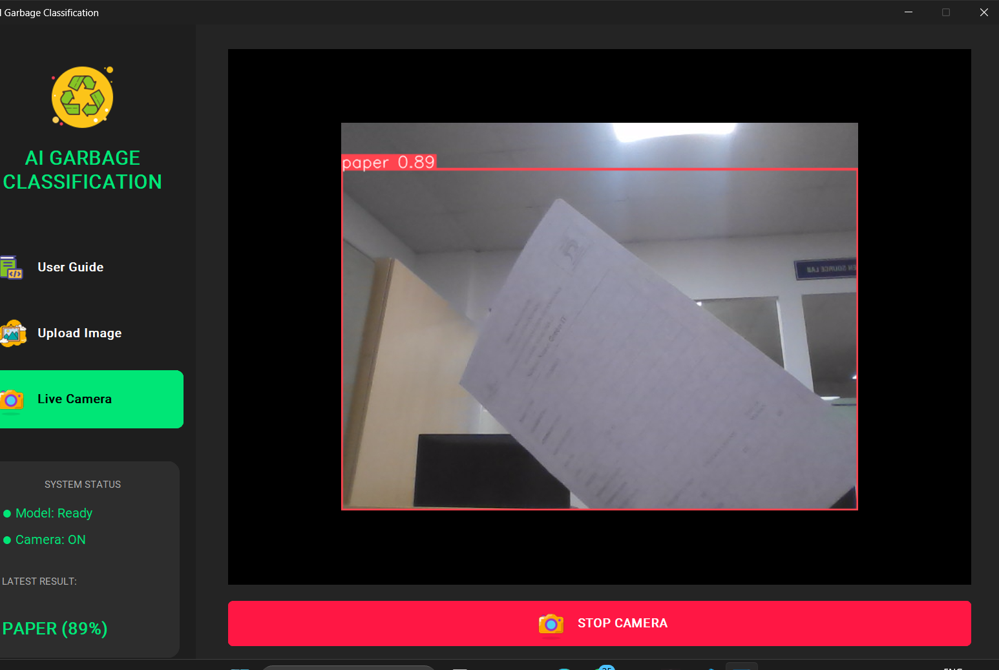

# Real-Time Waste Detection and Classification Using YOLO12-Based Deep Learning Model

##  Key Features

###  Real-time Detection
High-speed object detection using **YOLO12**, optimized for low latency inference.

###   Garbage Classification & Safety Monitoring SystemDual Mode GUI (customtkinter)

- **Static Image Analysis**
  - Upload and analyze images
  - Display bounding boxes with confidence scores

- **Live Camera Mode**
  - Real-time detection via webcam
  - Continuous frame-by-frame classification

###  Advanced Camera Analytics

- **Hazardous Waste Alert**
  - Detects batteries
  - Triggers visual red alert overlay (fire hazard prevention)

- **Safety Zones**
  - Uses scan ratios
  - Valid region filtering to remove background noise

- **Intelligent Tracking**
  - Powered by ByteTrack
  - Maintains consistent object IDs across frames

###  Modern UI
- Dark theme interface
- System status indicators
- Detection result history panel

---

##  Supported Categories

The model is trained to recognize **10 classes**:

| Class ID | Category | Type |
|----------|----------|------|
| 0 | Battery | Hazardous |
| 1 | Biological | Organic Waste |
| 2 | Cardboard | Recyclable |
| 3 | Clothes | Recyclable |
| 4 | Glass | Recyclable |
| 5 | Metal | Recyclable |
| 6 | Paper | Recyclable |
| 7 | Plastic | Recyclable |
| 8 | Shoes | Recyclable |
| 9 | Trash | Non-recyclable |

---

##  Installation

###  Prerequisites

- Python 3.8+
- (Optional) NVIDIA GPU + CUDA for acceleration

---

###  Clone Repository

```bash
git clone https://github.com/drakan02/garbage-classification
cd garbage-classification
```

---

###  Install Dependencies

```bash
pip install -r requirements.txt
```

###  Core Dependencies

- `ultralytics` — YOLO engine
- `customtkinter` — Modern GUI framework
- `opencv-python` — Image & video processing
- `torch` — Deep learning backend
- `torchvision` — Vision utilities

---

##  Usage

###  Launch Desktop GUI

```bash
python main.py
```

#### Available Tabs

- **User Guide**
  - Troubleshooting
  - Supported item list

- **Upload**
  - Select or drag image
  - View detection results with confidence

- **Camera**
  - Start/Stop webcam
  - Real-time object classification

---

## Sample Output

<p align="center">
  <br>
  <b>Real-time garbage detection using YOLO (Paper detected with 89% confidence)</b>
</p>
---


##  Project Structure

```
garbage-classification/
│
├── assets/                     
│   └── UI icons and logos
│
├── garbage_project/
│   └── train_run/
│       └── weights/
│           └── best.pt         # YOLOv12 trained weights
│
├── data.yaml                   # Dataset config + class names
├── main.py                     # GUI application
├── requirements.txt            # Python dependencies
└── README.md                   # Documentation
```

---

##  Technical Details

###  Model

- Architecture: YOLO12
- Weights location:
  ```
  garbage_project/train_run/weights/best.pt
  ```

---

###  Confidence Thresholds

| Mode | Threshold |
|------|----------|
| GUI Detection | 0.4 – 0.5 |
| Video Tracking | 0.05 |
| High-Confidence Lock | 0.70 |

---


##  Performance Notes

- GPU acceleration significantly improves FPS
- CPU-only mode works but reduces throughput
- Tracking mode requires lower confidence threshold for stability

---

##  Future Improvements (Optional Ideas)

- Web-based dashboard (FastAPI + React)
- Cloud deployment
- Auto dataset augmentation
- Multi-camera monitoring
- Firebase alert integration

---

